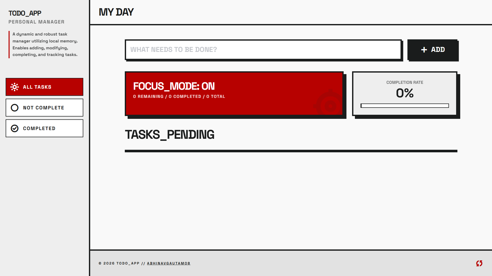
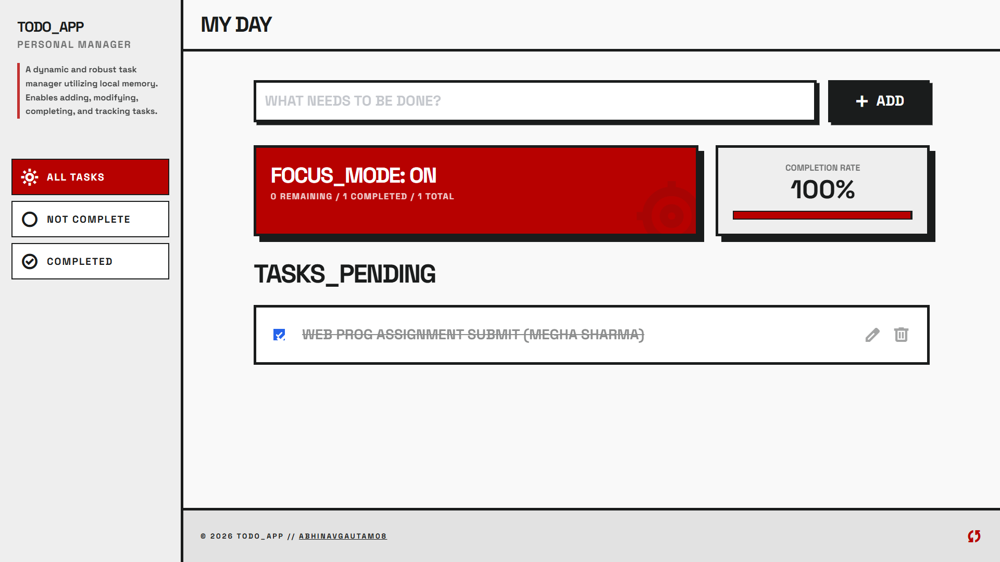
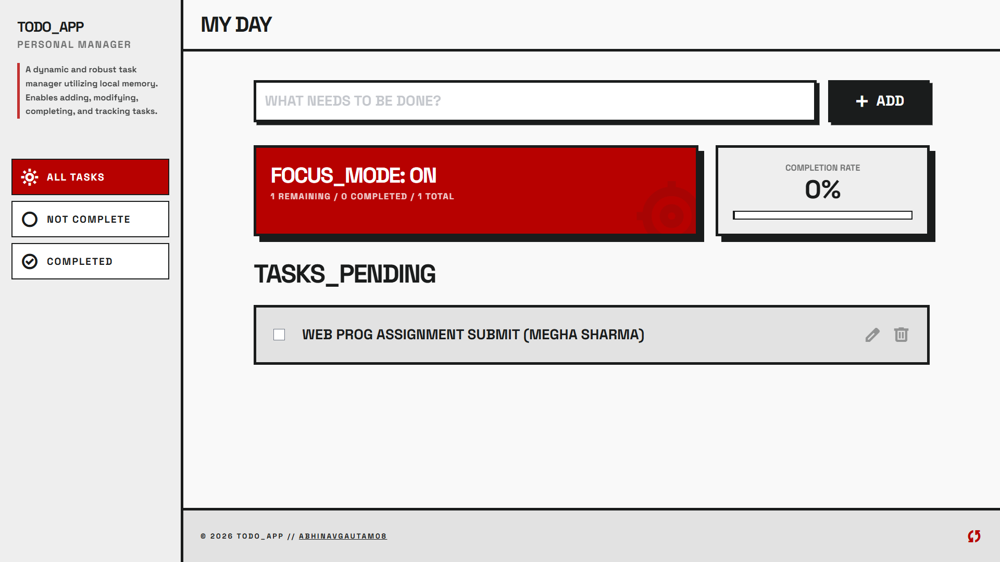

# To-Do List!

-----
## App Screenshots

| Home Screen | ScreenShot 2 | ScreenShot 3 |
| :---: | :---: | :---: |
|  |  |  |

## What can this app do?
- **Add tasks:** Type what you need to do and hit enter or click the ADD button.
- **Check things off:** Click the checkbox to mark a task as done.
- **Delete tasks:** Click the trash can icon to remove a task.
- **Edit tasks:** Click the pencil icon to change the text of a task you already added.
- **Save your progress:** It automatically remembers your tasks even if you refresh or close the page! It uses a feature in your browser called `localStorage`.
- **Track your progress:** The app automatically calculates your completion percentage and updates a fun progress bar!

## What files are inside?
This project is built using the three core building blocks of the web:
1. `index.html`: This creates the layout of the website. It holds the text boxes, buttons, and titles.
2. `style.css`: This makes the website look great! It adds shadows, colors, and animations. We also used a helpful tool called "Tailwind CSS" to style things quickly.
3. `script.js`: This is the brain of the app! It does the math, remembers your tasks, and makes the buttons actually work. It's written using very basic, beginner-friendly JavaScript, so it's easy to read and learn from!

## How do I run this?
It's super easy! You don't need to install any servers or complicated coding tools.
1. Download or save this folder to your computer.
2. Find the file named `index.html`.
3. Double-click it! It will instantly open in your web browser (like Chrome, Safari, or Edge) and you can start using your To-Do list.# dynamic_todo_list
